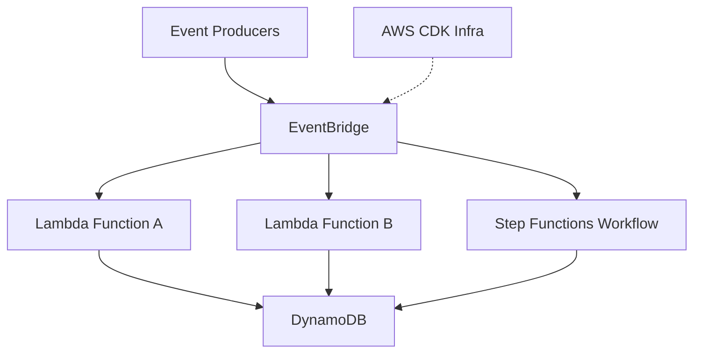

# Calebsons Cloud Serverless — Event-Driven Architecture

## Overview
A serverless event-driven system using AWS Lambda, DynamoDB, EventBridge, and Step Functions.

## Tech Stack
- AWS Lambda
- DynamoDB
- EventBridge
- Step Functions
- CDK

## Features
- Event orchestration
- Serverless compute
- Durable workflows
- Scalable design

## Architecture

## Setup
    cd infra
    npm install
    cdk deploy

## Deployment
- AWS CDK

## Roadmap
- Add analytics pipeline
- Add retry policies
